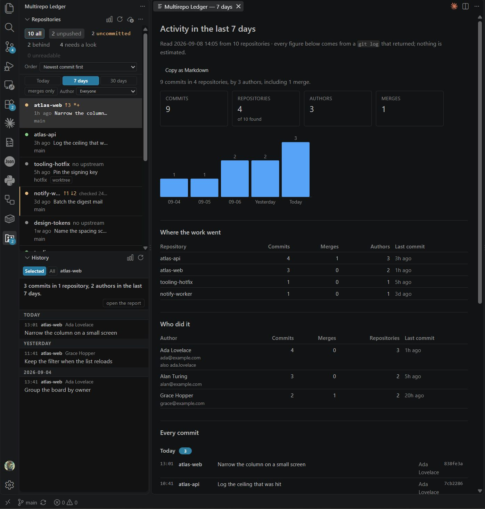

# Git Multirepo Ledger

*Not a mock-up. Every figure above was read by the extension from a real `.git`, in a directory
of invented repositories that `scripts/make-demo-workspace.ts` builds — so you can run it and
get the same board.*

**Every other repository list tells you where each repository *is*. This one tells you when it last
moved — and sorts by it.**

VS Code's own Repositories row already carries the branch and the ahead/behind figures, and so does
GitLens's. Neither carries the last commit: not on the row, not in the tooltip, not in the children
beneath it. And neither will sort by it — VS Code offers discovery order, name or path; GitLens
offers discovered, last-fetched or name. "Which of these moved, and when" is the question that
starts a working day, and nothing in the editor answers it.

The second half is where the repositories are. `git.repositoryScanMaxDepth` defaults to `1`, and
`git.scanRepositories` refuses an absolute path outright, so a repository two levels down — or in a
directory you have not opened — is invisible to both. This walks for `.git` at any depth, beneath
the open folders and beneath directories you name.

That is the whole of what this does. It is a status board, not a git client: no staging, no
committing, no pushing, no merging, no rebasing, no conflict resolution. **Nothing it runs can
change your working tree, your branches, or any commit you have made.**

One thing it runs is not a read: `git fetch`, offered per row and for the whole board, and
**disabled until you turn it on**. It writes remote-tracking refs, `FETCH_HEAD` and objects — and
nothing else, which is why it is the only write here. It exists because ahead and behind are
measured against remote-tracking refs: those are exactly as old as your last fetch, so without it a
row can read *in sync* having asked its server nothing for a month. It never merges, pushes or
prunes. When a repository wants credentials the fetch fails immediately rather than waiting on a
prompt that cannot be answered, and you are shown git's own words and the exact command.

## The row

One repository per row, three lines, nothing to expand — so twenty repositories are one pass of the
eye rather than twenty clicks.

1. **The repository name**, how far it has diverged from its upstream, and — dimmed at the end —
   how old that divergence figure is.
2. **The last commit**: when, then its subject. This is the line the extension exists for, and the
   list is sorted by it.
3. **What HEAD is doing** — `main`, or `detached at 7c86ebf`, or `rebasing 1/3 onto main` — and a
   marker when the repository is not an ordinary one: `worktree`, `submodule`, `bare`, `shallow`.

### Two things the row deliberately does not do

**It never renders an unestablished figure as zero.** `↑2 ↓1` is computed against a remote-tracking
ref that is exactly as old as the last fetch, so the row says how old that is and stays silent when
`.git/FETCH_HEAD` cannot prove even an attempt. A branch with no upstream reads `no upstream`, one
whose upstream is gone reads `gone`, and a working tree that has not been read yet is not the same
as a clean one. Absence of measurement never looks like a measured zero.

**It has no branch count.** No tool surveyed carries one, and a number you would not act on is not
a field.

A repository that will not answer — ownership git does not trust, a corrupt index, no commits yet,
a directory that vanished mid-scan — gets a row that says so, why, and the exact command that
failed, so you can retype it yourself.

## The history pane

Below the list, filling in for whichever row is selected: that repository's recent commits — hash,
age, author, subject, and chips for the branches and tags that point at each one. One `git log` per
page, not one per commit.

Commits that exist on no remote this repository knows about are marked **only here**, and only when
that was actually established: the check costs a second process and runs only when the row already
said there was something ahead, so an unmarked commit means "asked, and no", never "did not ask".

**Click a commit** and it expands into the files it changed. **Click a file** and it opens in the
editor's own diff, against its parent — for a repository the editor has never opened. That needs
this extension to serve the blobs itself, because VS Code's own `git:` URIs resolve only for
repositories the built-in Git extension has already opened, which excludes every repository this
board exists to show.

A merge says it is a merge and names its parents rather than showing a diff that would be true
against one side and misleading against the other.

## Settings

| Setting | Default | What it does |
|---|---|---|
| `multirepoLedger.additionalRoots` | `[]` | Absolute directory paths scanned for repositories in addition to the open folders. This is the normal way to use the extension: the directory your repositories live in is usually not the one you have open. |
| `multirepoLedger.exclude` | `[]` | Absolute paths of repositories to leave out entirely — a mirror, a vendored checkout, anything you keep but never work in. |
| `multirepoLedger.maxDepth` | `32` | How deep below each root the search for `.git` descends. A stop against a symlink cycle or a home directory, not a way to make the scan cheaper. |
| `multirepoLedger.dirty.enabled` | `true` | Show which repositories hold uncommitted work. The one read that walks the working tree, so it costs a second `git` process per repository on screen. While off, the row says nothing there rather than showing a zero. |
| `multirepoLedger.concurrency` | `0` | How many repositories are read at once. `0` derives it from what the machine says it can run in parallel. |
| `multirepoLedger.history.pageSize` | `50` | Commits per page in the history pane. |
| `multirepoLedger.badge` | `unpushed` | What the number on the Activity Bar icon counts. Every option is also a chip on the board, so one click shows exactly what the badge counted. A count of none draws no badge rather than a `0`. |
| `multirepoLedger.forge.enabled` | `false` | Open merge and pull request counts, via the `gh` and `glab` CLIs. **Off by default: it reaches the network.** While off, neither tool is invoked. The GitHub half is exercised against a real `gh`; the GitLab half is not yet, and fails to silence rather than to a guess. |
| `multirepoLedger.fetch.enabled` | `false` | Offer a **Fetch** button on each row and in the view title. **Off by default: it reaches the network.** It runs `git fetch` and nothing else — no merge, no push, no prune — so it can update what the remote knows without touching your working tree, your branches or any commit you have made. |
| `multirepoLedger.fetch.concurrency` | `4` | How many repositories are fetched at once. Unlike the read concurrency this cannot be derived from your machine: the limit belongs to a server the extension cannot see. |

## Privacy

Everything except `multirepoLedger.forge.enabled` is a local read of your own repositories. With the
forge setting on, `gh` and `glab` are run as subprocesses and talk to whatever hosts your
repositories point at, using credentials those tools already hold; no token is ever asked for or
stored, and there is no telemetry and no account. With it off, nothing leaves the machine.

## Licence

MIT — see [LICENSE](LICENSE).
